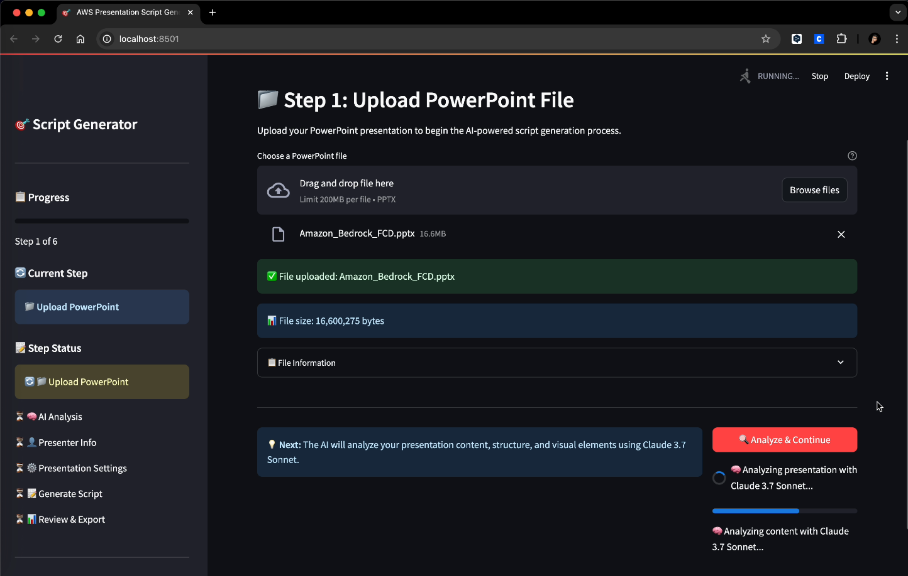
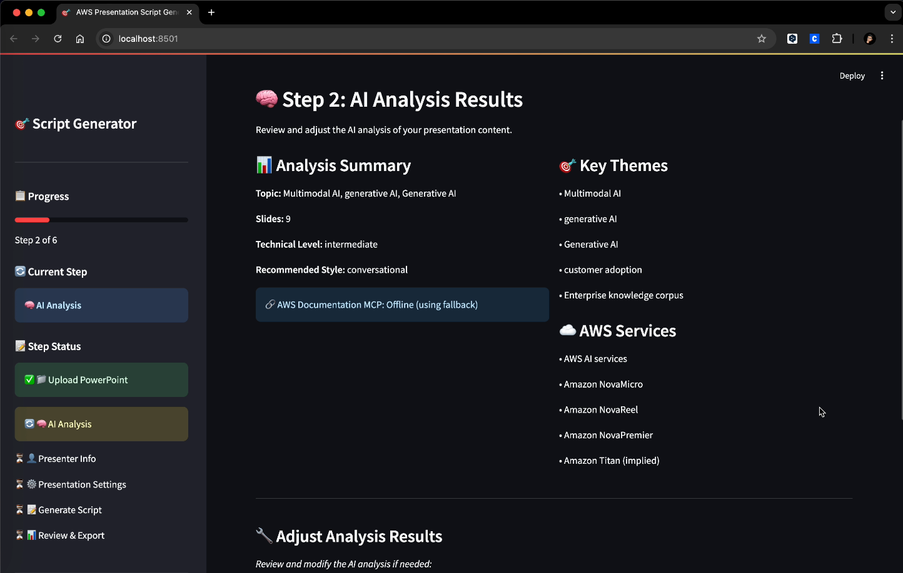
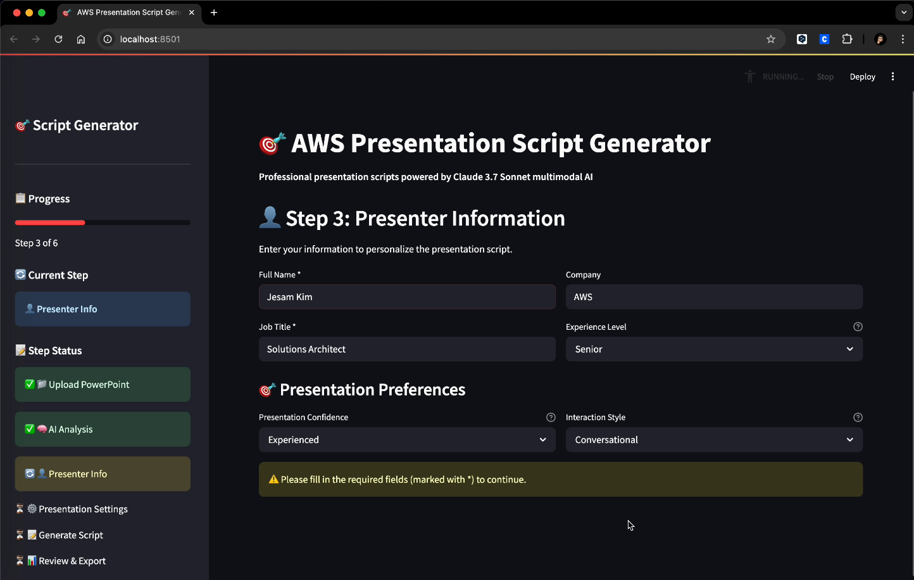
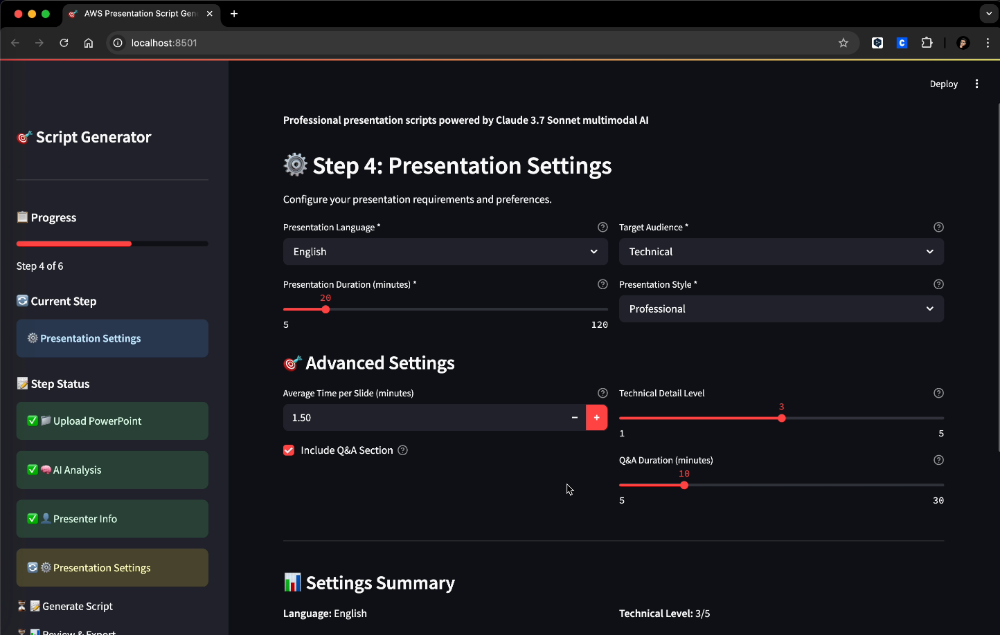
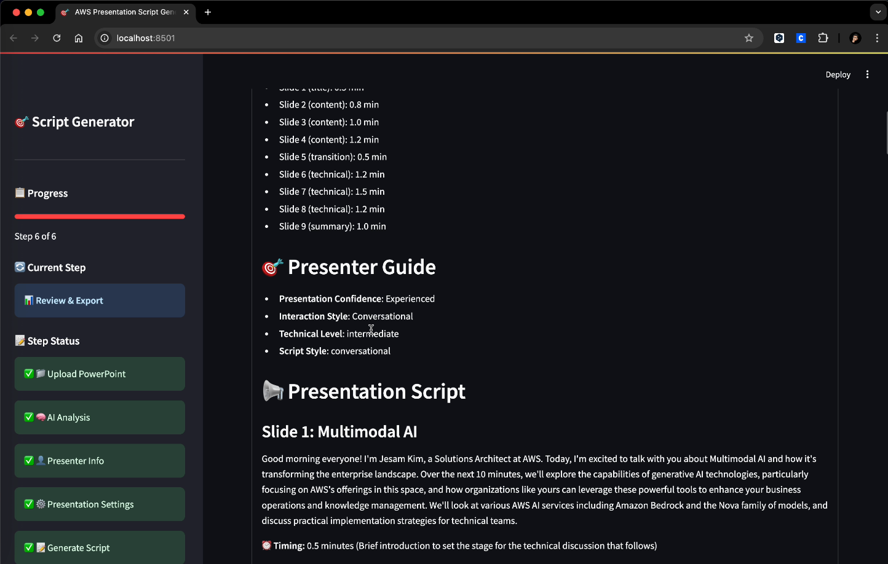

# AWS PowerPoint Script Generator

An intelligent presentation script generator that analyzes PowerPoint slides and creates natural, professional presentation scripts using AWS Bedrock and Claude Sonnet 4.5 with advanced caching and **real-time AWS Documentation MCP integration**.

[](https://www.python.org/downloads/)
[](https://aws.amazon.com/bedrock/)
[](https://github.com/modelcontextprotocol)
[](https://opensource.org/licenses/MIT)

## 🎯 Problem Statement

AWS Solutions Architects face a recurring challenge when preparing for customer presentations, technical sessions, and internal briefings. The process of creating engaging, accurate, and well-timed presentation scripts is both time-consuming and complex, requiring:

### Current Pain Points
- **Time-Intensive Process**: Manual script writing takes 2-4 hours per presentation
- **Technical Accuracy Concerns**: Ensuring AWS service information is current and accurate
- **Inconsistent Quality**: Script quality varies based on individual SA experience and available time
- **Language Barriers**: Need for localized scripts for global audiences (Korean, English, etc.)
- **Time Management Issues**: Difficulty in allocating appropriate time per slide based on content complexity
- **Repetitive Work**: Similar presentations require recreating scripts from scratch

### Business Impact
- **Reduced Productivity**: SAs spend valuable time on script preparation instead of customer engagement
- **Inconsistent Customer Experience**: Varying presentation quality across different SAs
- **Missed Opportunities**: Rushed script preparation leads to suboptimal customer presentations
- **Scalability Challenges**: Manual process doesn't scale with growing SA team demands

## 💡 Solution Overview

The AWS PowerPoint Script Generator addresses these challenges through an intelligent, automated approach that leverages cutting-edge AI technologies to transform PowerPoint presentations into professional, ready-to-deliver scripts.

### Key Capabilities
- **Multimodal AI Analysis**: Analyzes both text content and visual elements in slides
- **Intelligent Time Allocation**: Dynamically assigns presentation time based on slide complexity and importance
- **Real-time AWS Documentation**: Integrates with AWS Documentation MCP server for technical accuracy
- **Multi-Language Support**: Generates scripts in Korean and English with natural localization
- **Persona-Aware Generation**: Adapts to individual SA presentation styles and confidence levels
- **Real-Time Processing**: Generates comprehensive scripts in minutes, not hours

### Business Value
- **Time Savings**: Reduces script preparation time from 2-4 hours to 5-10 minutes (75-90% reduction)
- **Quality Consistency**: Maintains professional presentation standards across all SAs
- **Technical Accuracy**: Real-time AWS documentation integration ensures current information
- **Global Scalability**: Multi-language support enables consistent quality worldwide
- **Cost Efficiency**: Frees up SA time for high-value customer engagement activities
- **Knowledge Democratization**: Junior SAs can produce senior-level presentation quality

## ✨ Key Features

### 🔍 Intelligent Slide Analysis
- **Multimodal Processing**: Analyzes both text content and visual elements
- **AWS Service Detection**: Automatically identifies and categorizes AWS services mentioned
- **Content Summarization**: Extracts key concepts and themes from each slide
- **Technical Complexity Assessment**: Evaluates presentation difficulty level

### 🧠 AI-Powered Script Generation
- **Claude Sonnet 4.5 Integration**: Advanced language model for natural script creation
- **Prompt Caching**: Optimized performance with intelligent caching strategies
- **Persona-Aware Generation**: Adapts to presenter's style and confidence level
- **Slide Flow Continuity**: Ensures smooth transitions between slides

### 📚 Real-time AWS Knowledge Enhancement
- **MCP Integration**: Real-time AWS documentation retrieval via Model Context Protocol
- **Service-Specific Information**: Detailed AWS service descriptions and best practices
- **Fallback Knowledge Base**: Comprehensive offline AWS service database for reliability
- **Technical Accuracy**: Ensures accurate AWS terminology and concepts with live documentation

### 🎨 Customizable Output
- **Multiple Script Styles**: Technical, conversational, or formal presentation styles
- **Timing Guidance**: Precise timing recommendations for each slide
- **Speaker Notes**: Detailed presentation tips and guidance
- **Q&A Preparation**: Anticipated questions and suggested answers

### 🖥️ Dual Interface Modes
- **Web UI Mode**: Interactive Streamlit interface with visual feedback and step-by-step wizard
- **CLI Mode**: Command-line interface for automation, scripting, and batch processing
- **Flexible Workflow**: Choose the mode that fits your workflow - GUI for exploration, CLI for automation
- **Consistent Results**: Both modes use identical processing logic and produce same quality output

## 🏗️ Architecture

### Core Components

```
┌─────────────────┐    ┌──────────────────┐    ┌─────────────────┐
│   Streamlit     │    │   Multimodal     │    │   Script        │
│   Frontend      │───▶│   Analyzer       │───▶│   Generator     │
└─────────────────┘    └──────────────────┘    └─────────────────┘
                                │                        │
                                ▼                        ▼
                       ┌──────────────────┐    ┌─────────────────┐
                       │   Real MCP       │    │   Cache         │
                       │   Client         │    │   Manager       │
                       │   (AWS Docs)     │    │   (Multi-layer) │
                       └──────────────────┘    └─────────────────┘
```

### Technology Stack
- **Frontend**: Streamlit with responsive UI components
- **AI Models**: Claude Sonnet 4.5 via AWS Bedrock
- **Document Processing**: python-pptx, Pillow for image processing
- **MCP Integration**: Real-time AWS Documentation MCP server client
- **Caching**: Multi-layer caching with TTL management
- **Logging**: Structured logging with loguru

## 🚀 Quick Start

### Prerequisites

- **Python 3.10 or higher** (required for AWS Documentation MCP server compatibility)
- **AWS CLI** configured with appropriate permissions
- **Internet connection** for AWS Bedrock and MCP services

### ⚡ One-Command Installation (Recommended)

The fastest and most reliable way to get started:

```bash
# Clone the repository
git clone https://github.com/jesamkim/aws-pptx-script-generator.git
cd aws-pptx-script-generator

# Complete automated installation with environment validation
./manage.sh install

# Start the application
./manage.sh start
```

**That's it!** The application will be available at http://localhost:8501

### 🛠️ Management Commands

The `manage.sh` script provides comprehensive project management:

```bash
# Installation and Setup
./manage.sh install     # Full installation with advanced environment setup
./manage.sh validate    # Validate environment configuration
./manage.sh repair      # Automatically repair environment issues

# Application Management
./manage.sh start       # Start the Streamlit application
./manage.sh stop        # Stop the running application
./manage.sh restart     # Restart the application
./manage.sh status      # Show application and environment status

# Maintenance and Testing
./manage.sh test        # Run comprehensive test suite
./manage.sh update      # Update dependencies
./manage.sh clean       # Clean temporary files and caches
./manage.sh logs        # Show application logs

# Backup and Recovery
./manage.sh backup      # Create backup of configuration
./manage.sh restore     # Restore configuration from backup
./manage.sh uninstall   # Remove virtual environment and configs

# Help
./manage.sh help        # Show all available commands
```

### 🔧 Advanced Installation Options

#### Platform-Specific Scripts
```bash
# Linux/macOS - Basic installation
./install.sh

# Windows - PowerShell installation
.\install.ps1

# Advanced environment setup (Linux/macOS)
./scripts/setup_environment.sh
```

#### Manual Installation
<details>
<summary>Click to expand manual installation steps</summary>

1. **Clone Repository**
   ```bash
   git clone https://github.com/jesamkim/aws-pptx-script-generator.git
   cd aws-pptx-script-generator
   ```

2. **Set up Python Environment**
   ```bash
   python -m venv aws-venv
   source aws-venv/bin/activate  # Linux/macOS
   # aws-venv\Scripts\activate   # Windows
   ```

3. **Install Dependencies**
   ```bash
   pip install -r requirements.txt
   pip install awslabs-aws-documentation-mcp-server pydantic-settings
   ```

4. **Configure AWS Credentials**
   ```bash
   aws configure
   # Enter: Access Key, Secret Key, Region (us-west-2), Format (json)
   ```

5. **Run Application**

   **Option A: Web UI Mode (Interactive)**
   ```bash
   streamlit run streamlit_app.py
   ```

   **Option B: CLI Mode (Command-line)**
   ```bash
   python gen_script.py --pptx your_presentation.pptx --name "Your Name"
   ```
</details>

## 📖 Usage Guide

### Two Usage Modes

The application supports **two usage modes**:

1. **Web UI Mode (Streamlit)**: Interactive web interface with visual feedback
2. **CLI Mode (Terminal)**: Command-line interface for automation and scripting

### CLI Mode (Terminal)

Generate scripts directly from the command line without launching the web UI.

#### Basic Usage

```bash
# Simplest usage with defaults
python gen_script.py --pptx presentation.pptx

# With presenter name and duration
python gen_script.py --pptx sample.pptx --name "Jesam Kim" --duration 30

# Korean language script
python gen_script.py --pptx sample.pptx --name "김제삼" --language Korean --duration 45
```

#### Full Configuration Example

```bash
python gen_script.py \
  --pptx ./presentations/aws-summit.pptx \
  --name "Jesam Kim" \
  --title "Senior Solutions Architect" \
  --company "AWS" \
  --experience Senior \
  --confidence Experienced \
  --style Conversational \
  --language Korean \
  --duration 30 \
  --audience Technical \
  --pres-style Professional \
  --technical-depth 4 \
  --include-qa \
  --qa-duration 10 \
  --output my_presentation_script.md \
  --mode optimized
```

#### CLI Parameters

**Required:**
- `--pptx`: Path to PowerPoint file

**Presenter Information:**
- `--name`: Presenter name (default: "Presenter")
- `--title`: Job title (default: "Solutions Architect")
- `--company`: Company name (default: "AWS")
- `--experience`: Junior | Mid-level | Senior | Expert (default: Senior)
- `--confidence`: Beginner | Comfortable | Experienced | Expert (default: Comfortable)
- `--style`: Formal | Conversational | Interactive | Q&A Focused (default: Conversational)

**Presentation Settings:**
- `--language`: English | Korean (default: English)
- `--duration`: Total minutes (default: 30)
- `--audience`: Technical | Business | Mixed | Executive (default: Technical)
- `--pres-style`: Professional | Conversational | Technical | Educational (default: Professional)
- `--technical-depth`: 1-5 (default: 3)
- `--time-per-slide`: Average time per slide in minutes (default: 2.0)
- `--include-qa`: Include Q&A section (default: enabled)
- `--no-qa`: Exclude Q&A section
- `--qa-duration`: Q&A minutes (default: 10)

**Output Settings:**
- `--output`: Output file path (default: output_script.md)
- `--mode`: cached (faster) | optimized (better quality) (default: cached)
- `--verbose, -v`: Enable verbose output
- `--quiet, -q`: Suppress all output except errors

#### CLI Output Example

```
============================================================
Step 1/3: Analyzing PowerPoint Presentation
============================================================
INFO     | Loading PowerPoint file: sample.pptx
INFO     | Processing PowerPoint file...
INFO     | Converting slides to images for multimodal analysis...
INFO     | Analyzing presentation content with Claude Sonnet 4.5...
INFO     | Generating analysis summary...
SUCCESS  | Analysis completed: 15 slides analyzed

============================================================
Step 2/3: Preparing Script Generation Parameters
============================================================
INFO     | Presenter: Jesam Kim (Senior Solutions Architect)
INFO     | Language: Korean, Duration: 30 min
INFO     | Mode: CACHED

============================================================
Step 3/3: Generating Presentation Script
============================================================
INFO     | Generating script using cached mode...
SUCCESS  | Script generated: 5234 characters
SUCCESS  | Script saved to: output_script.md

============================================================
Script Generation Completed Successfully!
============================================================
SUCCESS  | Output file: output_script.md
SUCCESS  | Script length: 5234 characters
SUCCESS  | Word count: 876 words
```

#### View Help

```bash
python gen_script.py --help
```

### Web UI Mode (Streamlit)

#### Step-by-Step Process

#### 1. Upload PowerPoint File
Upload your .pptx file using the drag-and-drop interface or file uploader.



#### 2. AI Analysis Results
The system performs multimodal analysis of the uploaded PowerPoint and displays the analysis results including slide content, AWS services detected, and technical complexity assessment.



#### 3. Presenter Information
Enter your presenter information including name, title, and other personal details.



#### 4. Presentation Settings
Configure presentation parameters including language selection, presentation duration, target audience, and other settings.



#### 5. Generated Script Results
View the final generated presentation script with dynamic timing allocation and comprehensive content.



### Generation Options

#### Basic Cached Generation
- Fast script generation with prompt caching
- Suitable for standard presentations
- Optimized for performance

#### Optimized Agent Generation
- Advanced multi-agent workflow
- Enhanced AWS knowledge integration
- Parallel processing for complex presentations
- **Real-time MCP documentation retrieval**

## 🧪 Testing and Validation

### Automated Testing Suite

```bash
# Run all tests
./manage.sh test

# Individual test categories
python tests/test_installation.py      # Installation verification
python tests/test_mcp_connection.py    # MCP integration test
python tests/test_mcp_integration.py   # Comprehensive MCP test
python tests/test_script_generation.py # Script generation test
python tests/run_tests.py             # Complete test runner
```

### Environment Validation

```bash
# Comprehensive environment check
./manage.sh validate

# Advanced validation with detailed report
python scripts/validate_environment.py
```

### Test Categories

- **Installation Tests**: Verify all components are properly installed
- **MCP Integration Tests**: Test real-time AWS documentation retrieval
- **Unit Tests**: Individual component testing
- **Integration Tests**: End-to-end workflow validation
- **Performance Tests**: Caching and optimization validation

## 🔧 Configuration

### AWS Permissions

Required AWS IAM permissions:

```json
{
  "Version": "2012-10-17",
  "Statement": [
    {
      "Effect": "Allow",
      "Action": [
        "bedrock:InvokeModel",
        "bedrock:InvokeModelWithResponseStream"
      ],
      "Resource": [
        "arn:aws:bedrock:*::foundation-model/anthropic.claude-sonnet-4-5-*"
      ]
    }
  ]
}
```

### Bedrock Model Access

Claude Sonnet 4.5 is available directly through Amazon Bedrock without requiring separate model access approval. Simply ensure your AWS account has Bedrock permissions configured.

### Environment Configuration

The application uses these configuration files:
- **`.env`**: Environment variables (auto-generated during installation)
- **`mcp-settings.json`**: MCP server configuration (auto-generated)
- **`config/aws_config.py`**: AWS Bedrock client configuration
- **`config/mcp_config.py`**: MCP client configuration

## 🔍 Troubleshooting

### Automated Problem Resolution

```bash
# Automatic diagnosis and repair
./manage.sh validate    # Identify issues
./manage.sh repair      # Automatically fix common problems
./manage.sh status      # Check current status
```

### Common Issues and Solutions

#### Environment Issues
```bash
# Python version problems
./manage.sh validate    # Check Python version
# Follow installation guide for Python 3.10+

# Missing dependencies
./manage.sh repair      # Auto-install missing packages

# Virtual environment issues
./manage.sh install     # Recreate environment
```

#### AWS Configuration Issues
```bash
# AWS credentials not configured
aws configure

# Bedrock access issues
aws bedrock list-foundation-models --region us-west-2

# Region configuration
export AWS_REGION=us-west-2
```

#### MCP Integration Issues
```bash
# Test MCP connection
python tests/test_mcp_connection.py

# Verify MCP server installation
pip show awslabs-aws-documentation-mcp-server

# Check MCP configuration
cat mcp-settings.json
```

### Advanced Troubleshooting Tools

```bash
# Detailed environment validation
python scripts/validate_environment.py

# View comprehensive logs
./manage.sh logs

# Clean and reset environment
./manage.sh clean
./manage.sh install
```

## 📊 Performance Optimization

### Caching Strategy

The application implements multi-layer caching:

1. **Prompt Caching**: Claude API prompt caching for repeated requests
2. **Response Caching**: In-memory caching of AI responses
3. **MCP Caching**: AWS documentation caching with TTL
4. **Slide Analysis Caching**: Cached multimodal analysis results

### Performance Metrics

- **Script Generation**: 20-60 seconds depending on complexity
- **Cache Hit Rate**: 60-80% for repeated presentations
- **MCP Response Time**: 3-8 seconds per AWS service query
- **Memory Usage**: ~200-500MB during processing

## 🤝 Development

### Development Setup

1. **Clone and set up environment**
2. **Install development dependencies**
   ```bash
   pip install -r requirements-dev.txt
   ```
3. **Run tests to verify setup**
   ```bash
   ./manage.sh test
   ```

### Code Quality Standards

- Follow PEP 8 guidelines
- Use type hints for all functions
- Add docstrings for public methods
- Maintain comprehensive test coverage

## 📄 License

This project is licensed under the MIT License - see the [LICENSE](LICENSE) file for details.

---

## 🆕 What's New in v2.1

### ✨ **Advanced Environment Management**
- **Comprehensive Management Tool**: `./manage.sh` with 15+ commands for complete lifecycle management
- **Automated Environment Setup**: `scripts/setup_environment.sh` with OS detection and automatic dependency installation
- **Intelligent Validation**: `scripts/validate_environment.py` with 8-point comprehensive environment checking
- **Automatic Repair**: `scripts/repair_environment.py` for automatic issue resolution

### 🧪 **Enhanced Testing and Validation**
- **Comprehensive Test Suite**: Complete test coverage with automated test runner
- **Real-time MCP Testing**: Live AWS Documentation MCP server connectivity testing
- **Environment Validation**: Automated verification of all system components
- **Performance Monitoring**: Built-in performance metrics and optimization tracking

### 🔧 **Improved User Experience**
- **One-Command Installation**: Complete setup with `./manage.sh install`
- **Intelligent Problem Resolution**: Automatic diagnosis and repair of common issues
- **Comprehensive Status Monitoring**: Real-time application and environment status
- **Backup and Recovery**: Configuration backup and restore capabilities

### 🚀 **Production-Ready Features**
- **Advanced Error Handling**: Comprehensive error detection and recovery
- **Logging and Monitoring**: Structured logging with multiple log levels
- **Configuration Management**: Automated configuration file generation and validation
- **Performance Optimization**: Multi-layer caching and optimization strategies

---

**Version**: 2.1.1
**Last Updated**: November 4, 2025
**Compatibility**: Python 3.10+, AWS Bedrock, Claude Sonnet 4.5, AWS Documentation MCP Server

**🔗 MCP Integration Status**: ✅ **ACTIVE** - Real-time AWS documentation retrieval enabled  
**🛠️ Management Tools**: ✅ **ACTIVE** - Complete automated environment management  
**🧪 Testing Suite**: ✅ **ACTIVE** - Comprehensive validation and testing framework
