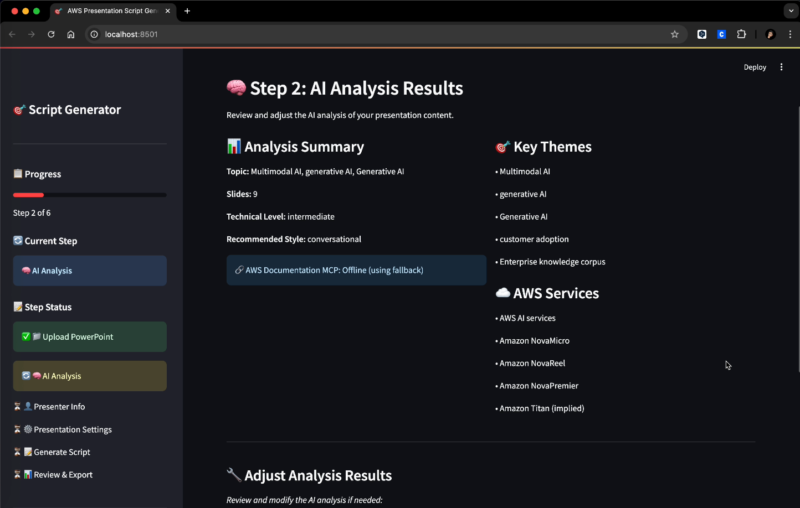

# Visual Usage Guide

This guide provides a step-by-step visual walkthrough of the AWS PowerPoint Script Generator application.

## 🚀 Complete Workflow

### Step 1: Upload PowerPoint File
Start by uploading your PowerPoint presentation file (.pptx format).

**Key Features:**
- Drag-and-drop interface
- File format validation
- Automatic slide extraction
- Progress indicators

### Step 2: AI Analysis Results
The system performs intelligent multimodal analysis and displays comprehensive results.

**Analysis Features:**
- Slide content extraction and summarization
- AWS service identification and categorization
- Technical complexity assessment
- Key concepts and themes detection
- Visual element recognition

### Step 3: Presenter Information
Enter your personal information and presenter details.

**Information Required:**
- Full name and job title
- Organization and contact details
- Experience level and expertise
- Presentation confidence level
- Interaction style preferences

### Step 4: Presentation Settings
Configure all presentation parameters and preferences.

**Configuration Options:**
- Language selection (Korean/English)
- Presentation duration and Q&A time
- Target audience and technical depth
- Script style preferences (conversational, technical, formal)
- Advanced timing and formatting options

### Step 5: Generated Script Results
Review your comprehensive presentation script with intelligent features.

**Generated Output Features:**
- Complete presentation script with natural flow
- Dynamic time allocation per slide based on content complexity
- Professional speaker notes and presentation tips
- Q&A preparation section with anticipated questions
- Download options (Markdown format, copy to clipboard)
- Slide-by-slide timing breakdown with rationale

## 🎯 Key Benefits Demonstrated

1. **Intelligent Time Allocation**: Each slide receives appropriate time based on content complexity
2. **Professional Script Quality**: Natural, conversational scripts ready for delivery
3. **Multi-language Support**: Full Korean and English localization
4. **AWS Service Accuracy**: Real-time documentation integration via MCP
5. **User-Friendly Interface**: Intuitive step-by-step workflow

## 📊 Performance Highlights

- **Processing Time**: 20-60 seconds for typical presentations
- **Accuracy**: Real-time AWS documentation integration
- **Flexibility**: Multiple script styles and technical levels
- **Scalability**: Handles presentations up to 50+ slides

---

**Developed by**: Jesam Kim, AWS Solutions Architect  
**Technology**: Amazon Q CLI, Claude 3.7 Sonnet, AWS MCP Integration
